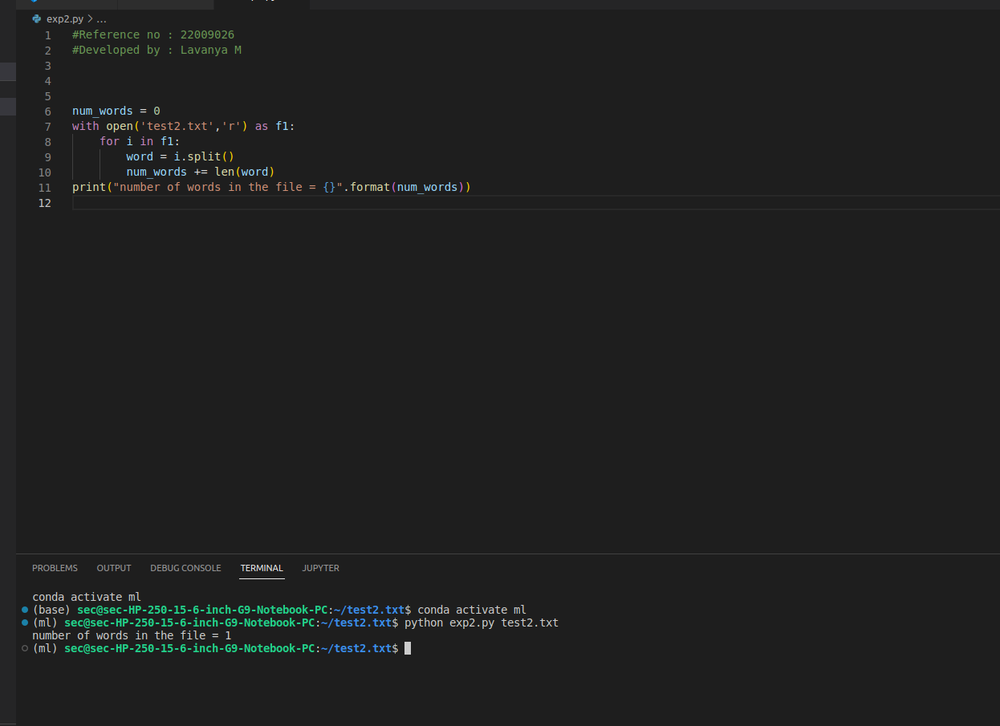
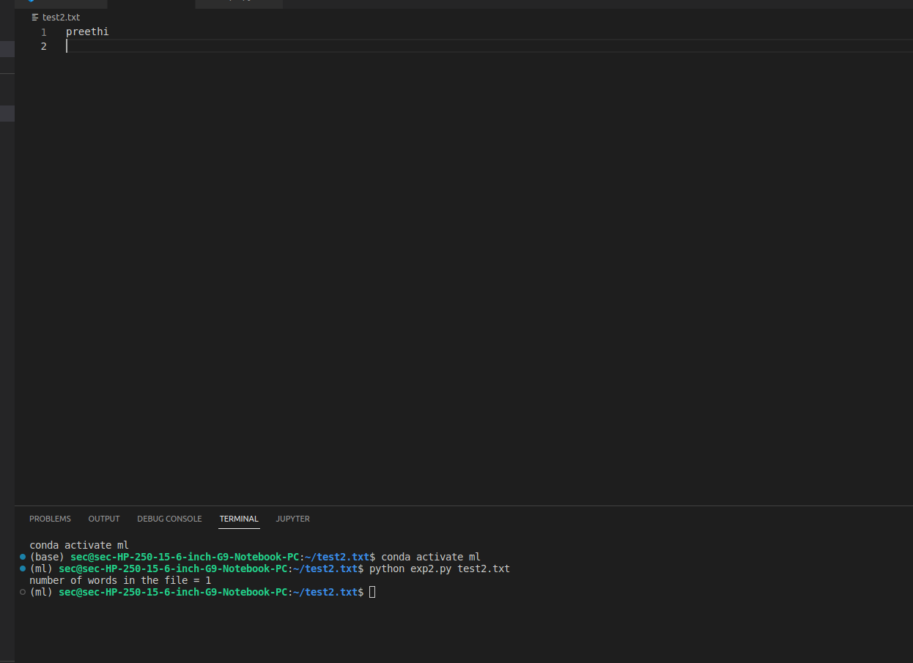

# Word-count
## AIM:
To write a python program for getting the word count from a text.
## EQUIPEMENT'S REQUIRED: 
PC
Anaconda - Python 3.7
## ALGORITHM: 

### Step 1:
Initiate the program by giving 0 as the initial value
### Step 2: 
Open the test file
 
### Step 3: 
Initiate a for loop

### Step 4:  
Use the split function

### Step 5: 
Give the print statements

### Step 6: 
Print the result

## PROGRAM:
```python
#Reference no : 22009026
#Developed by : Lavanya M
num_words = 0 
with open('test2.txt','r') as f1: 
    for i in f1: 
        word = i.split() 
        num_words += len(word) 
print("number of words in the file = {}".format(num_words))
```

### OUTPUT:




## RESULT:
Thus the program is written to find the word count from a text.
